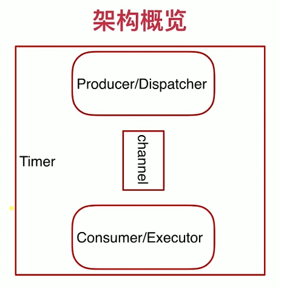

# 流媒体点播网站

# 流媒体网站整体介绍与架构梳理

## 1.1 为什么选择视频网站

> ```
> 1. Go是一门网络编程语言
> 2. 优良的native http库以及模板引擎（无需任何第三方框架）
> ```

## 1.2 总体架构：前后端分离

> ```
> 1. API会将一些业务的数据往DB里写。
> 2. Streaming模块：API会将视频的播放请求、上传和下载请求传入该模块。
> 3. Scheduler模块：会处理一些删除、软删除和定期清理等之类的事情。
> 4. Streaming和Scheduler都会同时访问DB，然而最重要的是会直接去文件系统里找相应的视频文件并做相应的处理。
> ```


## 1.3 前后端解耦

### 1.3.1 什么是前后端解耦

> ```
> 1. 前后端解耦是时下流行的web网站架构。
> 2. 前端页面和服务通过普通web引擎渲染。
> 3. 后端数据通过渲染后的页面脚本调用后处理和呈现。
> ```

### 1.3.2 前后端解耦的优势

> ```
> 1. 解放生产力，提高合作效率。
> 2. 松耦合的架构更灵活，部署更方便，更符合微服务的设计特征。
> 3. 性能的提升，可靠性的提升。
> ```

### 1.3.3 前后端解耦的缺点

> ```
> 1. 工作量大。
> 2. 前后端分离带来的团队成本以及学习成本。
> 3. 系统复杂度加大。
> ```


# API设计与架构

## 2.1 api

> ```
> 1. REST(Representational Status Transfer)API。
> 2. REST是一种设计风格，不是任何架构标准。
> 3. 当今RESTful API通常使用HTTP作为通信协议，JSON作为数据格式。
> 4. 统一接口(Uniform Interface)。
> 5. 无状态(Stateless)。
> 6. 可缓存(Cacheable)。
> 7. 分层(Layered System)。
> 8. CS模式(Client-server Atchitecture)。
> ```

## 2.2 API设计原则

> ```
> 1. 以URL(统一资源定位符)风格设计API。
> 2. 通过不同的METHOD(GET,POST,PUT,DELETE)来区分对资源的CRUD。
> 3. 返回码(Status Code)符合HTTP资源描述的规定。
> ```

## 2.3 API设计图


### 2.3.1 API设计：用户

> ```
> 1. 创建（注册）用户：URL:/user Method:POST,SC:201,400,500
> 2. 用户登录：URL:/user/:username Method:POST,SC:200,400,500
> 3. 获取用户基本信息：URL:/user/:username METHOD:GET,SC:200,400,401,403,500
> 4. 用户注销：URL:/user/:username Method:DELETE,SC:204,400,401,403,500
> ```

### 2.3.2 API设计：资源（视频）

> ```
> 1. List all videos: URL:/user/:username/videos Method:GET,SC:200,400,500
> 2. Get one video：URL:/user/:username/videos/:vid-id Method:GET,SC:200,400,500
> 3. DELETE one video：URL/user/:username/videos/:vid-id Method:DELETE,SC:204,400,401,403,500
> ```

### 2.3.3 API设计：评论

> ```
> 1. Show comments: URL:/videos/:vid-id/comments Method:GET,SC:200,400,500
> 2. Post a comment: URL:/videos/:vid-id/comments Method:POST,SC:201,400,500
> 3. Delete a comment: URL:/videos/:vid-id/comment/:comment-id Method:DELETE,SC:2O4,400,401,403,500
> ```

## 2.4 api之httphandler层设计

> ```
> API请求过程：handler->validation{1.request, 2.user}->business logic->response.
> 1. data model
> 2. error handling
> 注意：
> 1. 针对API请求过程对API请求采用分层架构的方式对其编写代码，可扩展、高可用、易于维护。
> 2. 对于request的处理采用这种分层架构对于编写test case是很容易的，
> 而且更能照顾到它的可扩展性，对工程上的效率也是非常高的。
> ```

## 2.5 api之数据库层设计

```
因为数据库模型的设计、数据库表的设计直接关系到最终业务逻辑的处理方式，所以首先对数据库层进行设计。
```


### 2.5.1 表结构

> ```mysql
> CREATE TABLE `users` (
>   `id` int(10) unsigned NOT NULL AUTO_INCREMENT,
>   `login_name` varchar(64) DEFAULT NULL,
>   `pwd` text NOT NULL,
>   PRIMARY KEY (`id`),
>   UNIQUE KEY `login_name` (`login_name`)
> ) ENGINE=InnoDB DEFAULT CHARSET=utf8;
> 
> CREATE TABLE `video_info` (
>   `id` varchar(64) NOT NULL,
>   `author_id` int(10) unsigned DEFAULT NULL,
>   `name` text,
>   `display_ctime` text,
>   `create_time` timestamp NOT NULL DEFAULT CURRENT_TIMESTAMP,
>   PRIMARY KEY (`id`)
> ) ENGINE=InnoDB DEFAULT CHARSET=utf8;
> 
> CREATE TABLE `comments` (
>   `id` varchar(64) NOT NULL,
>   `video_id` varchar(64) DEFAULT NULL,
>   `author_id` int(10) unsigned DEFAULT NULL,
>   `content` text,
>   `time` timestamp NOT NULL DEFAULT CURRENT_TIMESTAMP,
>   PRIMARY KEY (`id`)
> ) ENGINE=InnoDB DEFAULT CHARSET=utf8;
> 
> CREATE TABLE `sessions` (
>   `session_id` varchar(64) NOT NULL,
>   `TTL` tinytext,
>   `login_name` varchar(64) DEFAULT NULL,
>   PRIMARY KEY (`session_id`)
> ) ENGINE=InnoDB DEFAULT CHARSET=utf8;
> ```

## 2.6 api之Session

> ```
> 1. 什么是Session：在客户端和服务器端进行交互的时候，用的是http式的API或者是RESTful API,RESTful API有一个特点是：状态是不会保持的（Stateless），因此为了记录用户在服务端的状态，我们必须有一个东西来保存它，以完成一些功能。所有就需要用的Session。
> 
> 2. 为什么要用Session，如果不保存状态，则用户需要记录的一些东西就会丢掉，就比如不可能让用户在每个页面都进行登录操作。
> 
> 3. session和cookie的区别：session是一种在服务端为用户保存状态的机制，cookie是一种在客户端为用户保存状态的机制。一般在cookie端保存session_id，方便在用户对web进行操作的时候通过cookie端保存的session_id找到用户在服务端的状态。
> 
> 4. 本项目对session和cookie只进行最简单的应用，session只用来保存用户的登录状态，cookie只用来保存session_id, 在用户登录的时候，如果server端有该用户的session_id，则之后的操作都是可授权的，若没有session_id,则需要重新登录。
> ```

### 2.6.1 Session时序图


> ```
> 注意：
> 1. 系统初始化时，系统会自动从DB中get到所有的session_id到Cache中。
> 
> 2. 当更新用的session时，不仅要往Cache里写，还要往DB里写。这是因为DB在网页访问量、并发量比较大的时候，其读写压力是很大的，这就需要我们减少对DB的操作，因此用Cache缓解DB压力。
> 
> 3. session不在我们的业务逻辑中，它是一个系统的逻辑，所以在编写代码时需要把session单独拎出来单独放到一个folder里。因为我们每一个request，除了登录和注册以外，每一个request都需要和session相关。
> ```
>

### 2.6.2 Session的主要操作

> ```
> 1. 系统初始化时，系统会自动从DB中get到所有的session_id到Cache中。
> 2. 当有用户注册的时候，需要给该用户分配一个session_id，因此需要一个专门产生session的方法。
> 3. 当校验的时候，session可能会过期，因此在检查session时会给其返回一个是否过期的状态标志。
> ```
>

# Streaming

> ```
> 1. 静态视频，非RTMP。
> 2. 独立的服务，可独立部署。
> 3. 统一的api格式。
> ```

## 3.1 Stream Server

> ```
> 1. Streaming.播放视频
> 2. Upload files.上传视频 
> ```

```
注意：在创建文件，分割搭建代码架构的时候，一定要将它的模块分清楚，他每一块是干什么的，这样才能保证其在后期的可维护性和代码健壮性。一定不要把所有的代码都放入到同一个文件比如main.go里面，这样做是非常业余的。
```

## 3.2 流控模块

> ```
> /*
> 1. 在streamserver中Streaming和Upload files都需要保持长连接，
> 和之前的api短连接是不一样的。所以在多路长连接同时保持的时候就会出现一个问题，
> 如果再不断的发起连接，打开视频，总有一个时刻会把我们的server crash掉，因此我们需要
> 一个流控部分来控制connection。
> 
> 2. 用tokenbucket来实现流控模块。
> bucket：token1，token2...token3
> request, 获取token
> response，释放token
> go语言的理念：shared channel instead of shared memory.
> */
> ```

> ```go
> type ConnLimiter struct {
> 	concurrentConn int // 容量(可同时保持连接的最大连接数)
> 	bucket chan int
> }
> 
> // 构造函数
> func NewConnLimiter(cc int)  *ConnLimiter {
> 	return &ConnLimiter{
>         concurrentConn: cc,
> 		bucket:         make(chan int, cc), // channel缓冲区
> 	}
> }
> 
> func (cl *ConnLimiter) GetConn() bool {
> 	if len(cl.bucket) >= cl.concurrentConn {
> 		log.Printf("Reached the rate limitation.")
> 		return false
> 	}
> 
> 	cl.bucket <- 1 // 写入channel
> 	return true
> }
> 
> func (cl *ConnLimiter) ReleaseConn() {
> 	c :=<- cl.bucket
> 	log.Printf("New connection coming: %d", c)
> }
> ```

# Scheduler

> ```
> Scheduler顾名思义：调度器，调度无法通过RESTAPI无法马上有结果的任务，这些任务都会分发到scheduler里面，通过定时或延时触发。也就是说，通常scheduler用来处理异步任务。 
> ```

## 4.1 Scheduler包含什么

> ```
> 1. RESTful的http server：用来接收任务，将任务写入scheduler。
> 2. Timer:定时器
> 3. 生产者/消费者模型下的task runner：用来处理读取和执行两个任务。
> ```

### 4.1.1 Scheduler架构概览

> ```
> 1. 大的框架由Timer来启动。 
> 2. Timer里面有一个task runner。
> 3. task runner由三部分组成：Dispatcher、Executor、channel。Dispatcher会将读取到的任务通过channel发送给Executor，然后由Executor负责执行任务。
> ```


